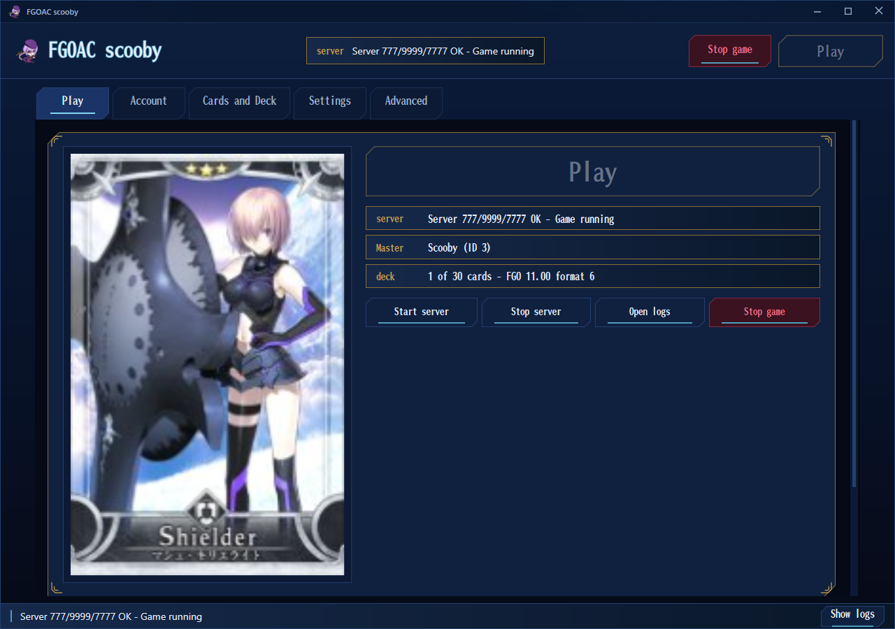
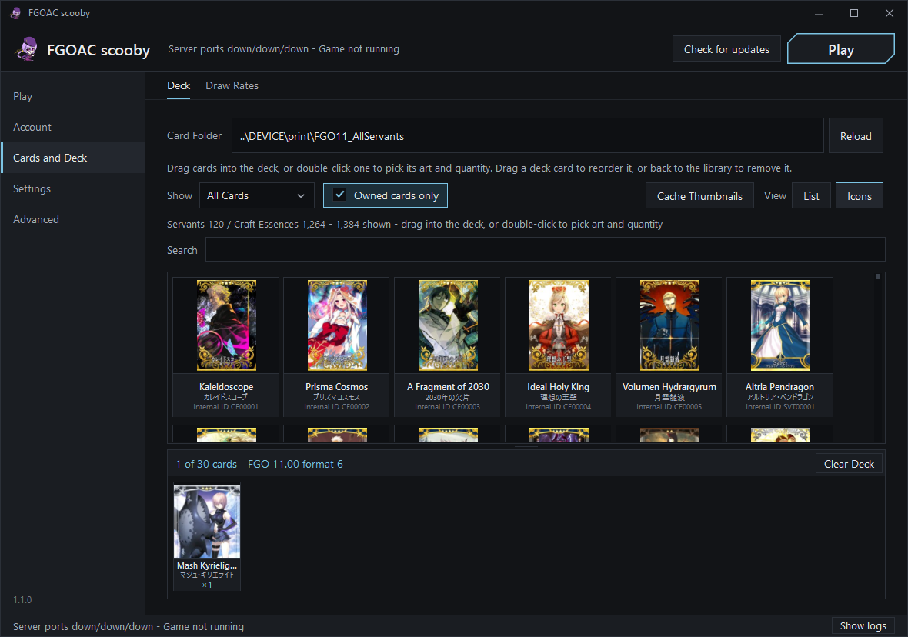
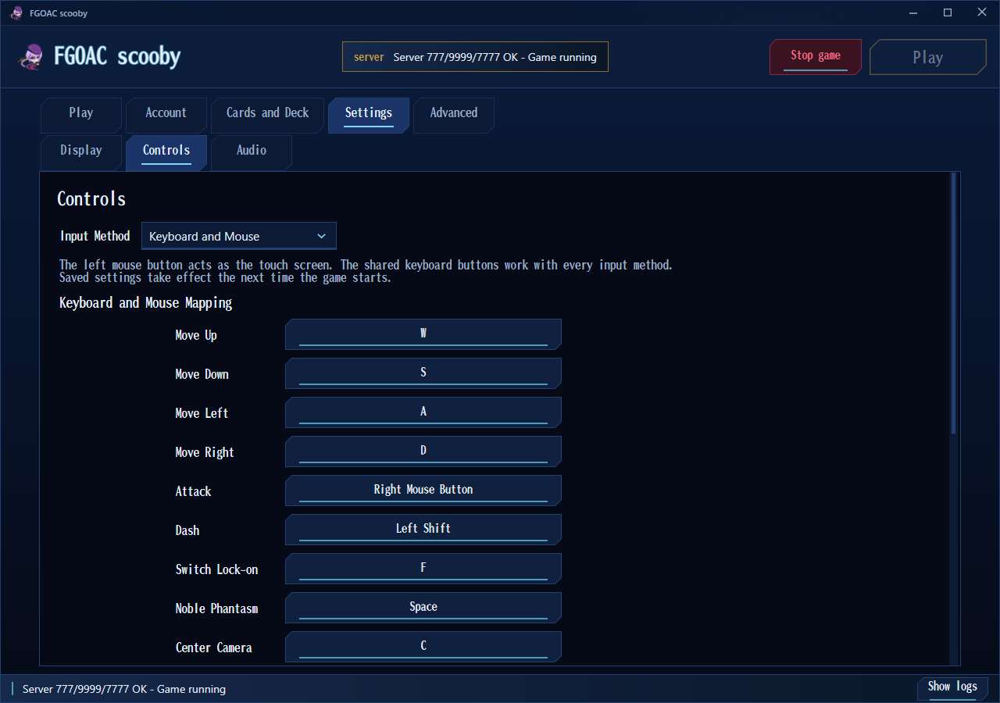

<div align="center">

# FGOAC scooby

**Fate/Grand Order Arcade เป็นภาษาไทย บนพีซีของคุณเอง**

[](https://github.com/felisiach/fgoac-scooby-thaitranslation/releases/latest)
[](https://github.com/felisiach/fgoac-scooby-thaitranslation/releases)
[](LICENSE)
[](https://discord.gg/aNK3KXBQzw)



</div>

FGOAC scooby คือแพตช์ภาษาไทยที่ทำโดยแฟนเกม พร้อมตัวเรียกเกมสำหรับ FGO Arcade local platform
แพตช์นี้แปลตัวเกมเองเป็นภาษาไทย ทั้งเมนู บทเรียนเริ่มต้น เนื้อเรื่อง หน้าจอต่อสู้ ร้านค้า และหน้าช่วยเหลือ
แล้วแทนที่หน้าจอหลักภาษาจีนของแพลตฟอร์มด้วยหน้าจอภาษาไทยที่เริ่มเซิร์ฟเวอร์ในเครื่องให้
จัดการบัญชี Master ของคุณ และประกอบเด็ค 30 ใบจากภาพการ์ดจริง
นี่ไม่ใช่ไฟล์เกมสำหรับดาวน์โหลดและไม่มีไฟล์เกมติดมาด้วย
เพราะจะถูกนำไปวางทับบน FGO Arcade local platform ที่คุณติดตั้งไว้อยู่แล้ว

## สิ่งที่คุณต้องมี

| | |
| --- | --- |
| ตัวเกม | ต้องมี **FGO Arcade local platform V1.01 หรือ V1.02** ติดตั้งอยู่แล้ว (แพ็กเกจของ Cloud23333) คือโฟลเดอร์ที่มี `App` และ `Server` อยู่ ควรใช้ V1.02 เพราะแก้ ERROR 4102 ประวัติเซอร์แวนต์ที่ว่างเปล่า และข้อผิดพลาดการซิงค์หลังจากอัปเกรดเซอร์แวนต์ |
| ระบบปฏิบัติการ | Windows 10 หรือ 11 แบบ 64-bit |
| การ์ดจอ | NVIDIA ที่ใช้ไดรเวอร์รุ่นปัจจุบัน สำหรับ AMD ตัวเรียกเกมจะติดตั้งเลเยอร์ความเข้ากันได้รุ่นเก่าให้เองเมื่อเป็นการติดตั้งใหม่บนเครื่องที่ไม่มีการ์ด NVIDIA เลเยอร์นี้ใช้ได้กับ RX 500, RX 6000, RX 7600 และกราฟิก Ryzen รุ่นเดสก์ท็อป ส่วนเลเยอร์รุ่นใหม่ของ fluphus (การตั้งค่า > การแสดงผล) ใช้ได้กับ RX 7900 XTX แต่บนการ์ดรุ่นอื่นจะหยุดทำงานตอนเข้าการต่อสู้ครั้งแรก กราฟิกออนบอร์ดของ Intel และกราฟิก Ryzen รุ่นโน้ตบุ๊กยังไม่รองรับด้วยเลเยอร์ทั้งสองตัว เลเยอร์ทั้งสองเป็นผลงานของชุมชนและยังปรับแต่งไม่เสร็จสมบูรณ์ ให้คาดหวังอัตราเฟรมที่ต่ำกว่าและข้อผิดพลาดในการแสดงผลบางส่วนเมื่อเทียบกับ NVIDIA หากมีเลเยอร์รุ่นใหม่กว่า สามารถวางไฟล์ลงในโฟลเดอร์ compat แล้วติดตั้งจากการตั้งค่า > การแสดงผลได้ |
| ซีพียู | Intel Core รุ่นที่ 3 (ปี 2012) ขึ้นไป หรือ Ryzen รุ่นใดก็ได้ ชิป Pentium และ Celeron ก่อนรุ่นที่ 12 ไม่มี F16C ซึ่งเป็นชุดคำสั่งที่เกมใช้ และจะหยุดทำงานพร้อม 0xC000001D ตอนเริ่ม |
| ไดรฟ์ | ไดรฟ์ใดก็ได้ **ยกเว้น E: หรือ Y:** ดูตารางด้านล่าง |
| สิทธิ์ | ผู้ดูแลระบบ มีหน้าต่างขออนุญาตของ Windows หนึ่งครั้งตอนตัวเรียกเกมเริ่มทำงาน |

ไม่จำเป็นต้องมี .NET และ Python เพราะตัวเรียกเกมมีรันไทม์ของตัวเองมาด้วย
และแพลตฟอร์มก็มี Python ของตัวเองมาให้

## การติดตั้ง

**คำเตือน:** ภาษาไทยและภาษาอังกฤษใช้ช่อง `App\zh` ช่องเดียวกัน
จึงติดตั้งทั้งสองภาษาพร้อมกันในเวอร์ชันเดียวกันไม่ได้

1. ดาวน์โหลดไฟล์ zip ของรีลีสล่าสุด แล้วแตกไฟล์ลงในโฟลเดอร์ FGO Arcade ของคุณ ข้าง `App` และ `Server`
2. เรียกใช้ **FGOAC scooby.exe** แล้วคลิก **Yes** ในหน้าต่างขออนุญาตของ Windows
3. กด **เล่น (Play)** เกมจะใช้เวลาราวหนึ่งนาทีกว่าจะถึงหน้าจอไตเติล

การเริ่มครั้งแรกจะจัดการส่วนที่เหลือให้เองทั้งหมด คือติดตั้งไฟล์ภาษาไทย ตรวจสอบว่าเกมเขียนลงโฟลเดอร์ของตัวเองได้
อนุญาตให้เกมและเซิร์ฟเวอร์ในเครื่องผ่าน Windows Firewall สร้างบัญชี **Master** พร้อมชุดเซอร์แวนต์และ
Craft Essence ครบทั้งหมด และตั้งการแสดงผลเป็นโหมดหน้าต่าง 1280x720 บนจอหลักของคุณ
การเริ่มครั้งต่อ ๆ ไปจะไปที่หน้าเล่นทันที

ติดตั้งไว้อยู่แล้วใช่ไหม หน้าเล่นจะขึ้นแถบแจ้งเมื่อมีเวอร์ชันใหม่ ปุ่ม **ติดตั้งตอนนี้ (Install now)**
จะดาวน์โหลด ติดตั้ง แล้วเริ่มตัวเรียกเกมใหม่ และมีหน้าต่างเล็ก ๆ บอกว่ามีอะไรเปลี่ยนไปบ้าง
บัญชี เด็ค การตั้งค่า และเลเยอร์กราฟิกของคุณจะคงอยู่เหมือนเดิม
การแตกไฟล์รีลีสใหม่ทับโฟลเดอร์เดิมก็ให้ผลเหมือนกัน

[`docs/GUIDE_EN.pdf`](docs/GUIDE_EN.pdf) คือคู่มือผู้เล่นฉบับเต็ม ครอบคลุมวิธีได้เซอร์แวนต์ การควบคุม
การออกรบทีละขั้นตอน ร้านแลกเปลี่ยน และการแก้ปัญหา

## สิ่งที่ใช้งานได้

- **ข้อความในเกม** - แปลแล้ว 65,266 บรรทัด ทั้งเนื้อเรื่อง เควสต์ ประวัติเซอร์แวนต์และ Craft Essence
  สกิล ไอเทม ภารกิจ และทุกเมนู ชื่อต่าง ๆ อ้างอิงตามฉบับภาษาอังกฤษ
- **งานภาพในเกม** - คลังสไปรต์ที่สร้างใหม่ 240 ชุด ทั้งหน้าไตเติล บทเรียนเริ่มต้น เทอร์มินัล การจัดทีม
  HUD การต่อสู้ หน้าผลลัพธ์ ร้านค้า การสังเคราะห์ กล่องของขวัญ ภารกิจมาสเตอร์ อันดับ หน้าช่วยเหลือ
  และตัวแก้ไขไตเติล
- **เล่นคนเดียวแบบออฟไลน์ได้ครบวงจร** - ทั้งบทเรียนเริ่มต้น การออกรบเดี่ยว เทอร์มินัล ร้านแลกเปลี่ยน
  การสังเคราะห์ My Room อันดับ และตัวแก้ไขไตเติล
- **ตัวเรียกเกม** ครบทั้งห้าหน้า พร้อมชื่อการ์ดภาษาอังกฤษอย่างเป็นทางการและเอฟเฟกต์ของ Craft Essence
- **การซัมมอนในเกม** - สุ่มจากพูลของเซิร์ฟเวอร์ในเครื่องตามน้ำหนักที่ตั้งไว้ในหน้าอัตราการสุ่ม
  คุณไม่จำเป็นต้องพึ่งมันเพื่อให้ได้การ์ดครบ เพราะหน้าบัญชีมอบให้ครบได้ในคลิกเดียว
  และคลังการ์ดมีการ์ดครบทั้ง 1,384 ใบ
- **ชุดเด็คและพรีเซ็ตอัตราการสุ่ม** - บันทึก โหลด และลบได้ไม่จำกัดจำนวนจากหน้าการ์ดและเด็ค
  และหน้าอัตราการสุ่ม พร้อมส่งออกและนำเข้าเพื่อส่งให้ผู้เล่นคนอื่นเป็นไฟล์เล็ก ๆ

## สิ่งที่ยังใช้งานไม่ได้

- **ไม่มีการเล่นออนไลน์** ทุกอย่างทำงานกับเซิร์ฟเวอร์ในเครื่อง ไม่มีการจับคู่ผู้เล่น
  และไม่มีบริการอย่างเป็นทางการให้เชื่อมต่ออีกแล้ว
- **ยังไม่รองรับกราฟิก Intel** กราฟิกออนบอร์ดของ Intel (Iris Xe) และ Intel Arc หยุดทำงานกับเลเยอร์
  ความเข้ากันได้ทั้งสองตัว เช่นเดียวกับกราฟิก Ryzen รุ่นโน้ตบุ๊ก กำลังหาทางแก้อยู่
  จนกว่าจะแก้ได้ เกมต้องใช้การ์ด NVIDIA หรือการ์ด AMD ที่ระบุไว้ในหัวข้อสิ่งที่คุณต้องมี
- **หน้าจออีเวนต์บางหน้ายังเป็นภาษาญี่ปุ่น** ได้แก่ แบนเนอร์อีเวนต์ co-op หน้าจอผลลัพธ์ co-op
  และร้านค้าอีเวนต์รุ่นหลัง ๆ ทั้งหมดเป็นงานภาพ ไม่ใช่ข้อความ และไม่กระทบส่วนอื่นเลย

## ตัวเรียกเกม

| หน้า | หน้าที่ |
| --- | --- |
| **เล่น (Play)** | เล่นเกมและหยุดเกม เริ่มเซิร์ฟเวอร์และหยุดเซิร์ฟเวอร์ในเครื่อง เปิดล็อก และแสดงสถานะแบบเรียลไทม์ของเซิร์ฟเวอร์ มาสเตอร์ที่เลือกอยู่ และเด็ค เป็นหน้าที่ควรเปิดค้างไว้ขณะเกมกำลังทำงาน |
| **บัญชี (Account)** | สร้าง เลือก และลบบัญชีมาสเตอร์ และมอบชุดเซอร์แวนต์ Craft Essence และไอเทมครบทั้งหมดให้บัญชีใดบัญชีหนึ่งได้ในคลิกเดียว พร้อมเลเวล สายสัมพันธ์ คอสตูม และรางวัลผ่านด่าน |
| **การ์ดและเด็ค (Cards and Deck)** | คลังการ์ดและตัวแก้ไขเด็ค ค้นหาด้วยชื่อภาษาอังกฤษอย่างเป็นทางการได้ พร้อมเอฟเฟกต์ของ Craft Essence ตามสำนวนของ FGO NA เด็คจะถูกส่งให้เกมทุกครั้งที่คุณกดเล่น |
| **การตั้งค่า (Settings)** | การแสดงผล ได้แก่ จอภาพ ความละเอียด สัดส่วนภาพ อัตราเฟรม และโหมดการแสดงผล การควบคุม ได้แก่ คีย์บอร์ด XInput หรือ DualSense แบบเนทีฟ พร้อมเดดโซน การสั่น และการทดสอบคอนโทรลเลอร์ และเสียง |
| **ขั้นสูง (Advanced)** | เซิร์ฟเวอร์ในเครื่องและการตั้งค่าของมัน การวินิจฉัยและความช่วยเหลือที่มีรหัสข้อผิดพลาดของเกมทุกรหัสพร้อมวิธีแก้ ตัวชี้เมาส์ ดีบัก โหมดถ่ายภาพ และเกี่ยวกับ |

ตัวเรียกเกมอัปเดตตัวเองได้ โดยถาม GitHub Releases ว่ามีเวอร์ชันใหม่กว่าหรือไม่
แล้วเสนอที่จะดาวน์โหลดและติดตั้งให้ การแก้คำแปลจึงถึงมือคุณได้โดยไม่ต้องติดตั้งใหม่

<p align="center">
  
  
  
</p>

## ถ้ามีอะไรผิดพลาด

เปิด **ขั้นสูง > การวินิจฉัยและความช่วยเหลือ** ก่อนเป็นอันดับแรก หน้านั้นแสดงรหัสข้อผิดพลาดของเกมทุกรหัส
พร้อมวิธีแก้ และคำตอบมักอยู่ที่นั่น

| อาการที่เห็น | สาเหตุ | สิ่งที่ต้องทำ |
| --- | --- | --- |
| **ERROR 4102** | เกมติดต่อเซิร์ฟเวอร์ในเครื่องไม่ได้ บน V1.01 ยังเกิดขึ้นเมื่อชื่อเครื่องตรงกับชื่อผู้ใช้ด้วย | เริ่มเซิร์ฟเวอร์จากหน้าเล่น รอจนกว่าจะรายงานว่าพร้อม แล้วกดเล่นอีกครั้ง ถ้ายังเกิดซ้ำบน V1.01 ให้อัปเดตเป็น V1.02 ของ Cloud23333 ซึ่งแก้ปัญหานี้แล้ว |
| **ERROR 8404** ตอนบูต | Startup Mode ของตัวเกมเองถูกบันทึกไว้เป็น Satellite (Sub Unit) เกมจึงรอเครื่องหลักที่ไม่มีอยู่จริง | ที่หน้าจอข้อผิดพลาดให้กด **F1** เพื่อเข้า Game Test Menu (**F2** เลื่อนลูกศร **F1** ยืนยัน) เปิด **Game Settings** ตั้ง **Startup Mode** เป็น **Main Unit** แล้วเลือก **Exit** การบูตครั้งถัดไปจะถึงหน้าไตเติล |
| **Cannot use Aime card** ที่หน้าจอไตเติล | ข้อความแรกที่เกมส่งไปยังเซิร์ฟเวอร์ในเครื่องหมดเวลาในการบูตครั้งนั้น | ปิดเกม ตรวจว่าเซิร์ฟเวอร์ขึ้นว่าพร้อมในหน้าเล่น แล้วกดเล่นอีกครั้ง |
| **0x80131515** ตอนกดเล่น หรือเซิร์ฟเวอร์หยุดพร้อมข้อความเกี่ยวกับ `FGO_Runtime.dll` | Windows ทำเครื่องหมายว่า `App\FGO_Runtime.dll` ถูกดาวน์โหลดมาจากอินเทอร์เน็ต และ PowerShell ปฏิเสธที่จะโหลดไฟล์ที่มีเครื่องหมายนั้น | ตัวเรียกเกมจะล้างเครื่องหมายนี้ให้เอง ถ้ายังกลับมาอีก ให้คลิกขวาที่ไฟล์ เปิด Properties แล้วติ๊ก **Unblock** |
| **"ไฟล์บางไฟล์ที่เกมต้องใช้หายไป"** ตอนตัวเรียกเกมเริ่มทำงาน | ไฟล์ zip ถูกแตกไว้ที่อื่นที่ไม่ใช่โฟลเดอร์เกม หรือโฟลเดอร์นั้นไม่เคยได้รับอัปเดต V1.01 ของ Cloud23333 | แตกไฟล์ลงในโฟลเดอร์ที่มี `App` และ `Server` อยู่ ให้ `FGOAC scooby.exe` วางอยู่ข้างกัน และติดตั้ง V1.01 หรือ V1.02 ก่อน |
| **หน้าต่างเกมเปิดขึ้นแล้วปิดไปเอง** (exit code 22) ทั้งที่การตรวจสอบสภาพแวดล้อมผ่าน | ยังระบุสาเหตุไม่ได้ | ลองใช้โหมดหน้าต่าง 1280x720 บนจอหลัก เวลารายงานปัญหา ให้แนบ `logs\ago-crash-*.dmp` และบอกรุ่นการ์ดจอกับเวอร์ชันไดรเวอร์ของคุณ |
| **"Update failed" ตอนท้ายของตัวอัปเดต V1.02 ของ Cloud23333** หลังจากที่มันขึ้นว่าติดตั้งไฟล์แพตช์แล้ว | ไฟล์ของเขาลงครบแล้ว มีเพียงขั้นตอนสุดท้ายที่หยุดไป คือการกู้คืนเซอร์แวนต์ที่อัปเกรดไว้ก่อน V1.02 เพราะสภาพแวดล้อม Python ที่เขาแถมมาชี้ไปยังโฟลเดอร์ที่มีอยู่เฉพาะบนเครื่องของเขา | ใช้ FGOAC scooby ตามปกติ ถ้าคุณเคยอัปเกรดเซอร์แวนต์ไว้ก่อน V1.02 และอยากกู้คืน ให้รันคำสั่งนี้หนึ่งครั้งจากโฟลเดอร์เกม: `Server\python\python.exe Server\tools\repair_fgo_grail.py --logs logs --report logs\grail-recovery.json --apply` |
| **ERROR 4104** | ติดตั้งอยู่บนไดรฟ์ **E:** หรือ **Y:** ฮุกไฟล์ของตัวเกมเองส่งทุกพาธบนไดรฟ์เหล่านั้นไปยังจุดเชื่อมข้อมูลของตู้ เกมจึงเปิดไฟล์ของตัวเองไม่ได้ | ย้ายทั้งโฟลเดอร์เกมไปไว้ที่ไดรฟ์อื่น |
| **ERROR 4105** ราวเก้าสิบวินาทีหลังเปิดเกม | เกมไม่ได้ถูกเรียกใช้ในฐานะผู้ดูแลระบบ | คลิก **Yes** ในหน้าต่างขออนุญาตของ Windows ตอนตัวเรียกเกมเริ่มทำงาน |
| **0xC0000005** ไม่กี่วินาทีหลังเปิดเกม | Windows Defender **Controlled Folder Access** กำลังบล็อกไม่ให้เกมเขียนไฟล์ของตัวเอง | อนุญาตโฟลเดอร์เกมหรือ `App\ago.exe` ใน Windows Security > Virus and threat protection > Ransomware protection |
| **จอดำตอนเปิดเกม** | เกือบทุกครั้งเป็นเรื่องไดรเวอร์ NVIDIA ไม่ใช่ตัวแพตช์ | อัปเดตไดรเวอร์แล้วลองใหม่ |
| **เกมค้างที่จอดำในการเปิดครั้งแรกสุด** | มีหน้าต่างถามของ Windows Firewall รออยู่หลังหน้าต่างเกม ปกติตัวเรียกเกมสร้างกฎเหล่านั้นให้เอง แต่นโยบายขององค์กรหรือชุดโปรแกรมความปลอดภัยอาจขัดขวางได้ | มองหาหน้าต่างนั้นในแถบงาน แล้วอนุญาตทั้ง `Server\python\python.exe` และ `App\ago.exe` |
| **เมนูหลักทำงานผิดปกติทันทีหลังจบบทเรียนเริ่มต้น** | เป็นอาการที่ทราบกันดีของช่วงส่งต่อจากบทเรียนไปยังเมนูหลัก | เริ่มเกมใหม่หนึ่งครั้ง |
| **เกมหยุดทำงานตอนโหลดการต่อสู้ครั้งแรกบนการ์ด AMD** exit code 22 | เลเยอร์รุ่นใหม่สร้างเชเดอร์ของเกมบนการ์ดใบนั้นไม่สำเร็จ | ไปที่ การตั้งค่า > การแสดงผล > ย้อนกลับไปใช้เลเยอร์รุ่นเก่า แล้วกดเล่น |
| **exit code 22 พร้อม 0xC000001D** ทันทีหลังเริ่ม | ซีพียูไม่มี F16C | แก้ไม่ได้บนซีพียูตัวนั้น |
| **ERROR 6401** ตอนเริ่ม เมื่อต่อคอนโทรลเลอร์หรืออุปกรณ์ USB | ยังระบุสาเหตุไม่ได้ | ผู้เล่นรายงานว่าอาการหายไปเมื่อปิด USB selective suspend ของ Windows (Power Options > Change plan settings > Change advanced power settings > USB settings) |
| **ตัวเรียกเกมบอกว่าโฟลเดอร์นี้ไม่เคยได้รับ V1.01** หรือบอกว่า fgohook.dll ยังเป็น 11.00 | อัปเดต V1.01 ของ Cloud23333 ไม่เคยถูกติดตั้ง หรือติดตั้งค้างกลางคัน | แตกไฟล์ V1.02 ของ Cloud23333 ทับโฟลเดอร์เกมและปล่อยให้เขียนทับ แล้วเปิดตัวเรียกเกมอีกครั้ง |
| **ไม่มีการ์ดเลยหลังการเริ่มครั้งแรก**, ERROR 0949 หรือ ERROR 0087 เมื่อเกมอยู่บนไดรฟ์แบบ Storage Spaces หรือ ReFS | ไฟล์ RAR บางส่วนแตกไม่สำเร็จ หรือไดรฟ์ปฏิเสธการเขียนเซฟของเกม | แตกไฟล์เกมหลักใหม่และปล่อยให้เขียนทับ และเก็บการติดตั้งไว้บนไดรฟ์ NTFS ธรรมดา |
| **Google Drive เปลี่ยนชื่อไฟล์ RAR** (เป็น part1-003 และอื่น ๆ) | Google Drive เปลี่ยนชื่อไฟล์ที่ดาวน์โหลดพร้อมกันแทนที่จะคงหมายเลขส่วนเดิมไว้ | เปลี่ยนชื่อกลับเป็น FGOA_Cloud23333.part1.rar, part2.rar ... และแตกไฟล์ zip เล็กเพื่อให้ได้ part5.rar ก่อนจะแตก part1 |
| **ลิงก์ดาวน์โหลดจาก 123 Pan** | ไม่ใช่ของ Cloud23333 | ใช้เฉพาะลิงก์ในคำอธิบาย Bilibili ของเขาเท่านั้น |

เวลารายงานปัญหา ให้เปิด issue แล้วบอกว่าคุณอยู่ที่หน้าจอไหนและคาดหวังอะไร แนบเท่าที่คุณมีจากโฟลเดอร์
`logs` ที่อยู่ข้าง `App` ได้แก่ `fgo-last-launch.log`, `fgozh.log`, `server-control.log`,
`artemis-stderr.log`, `mariadb.log` และ `environment-check.txt` ซึ่งหน้าการวินิจฉัยและความช่วยเหลือ
เขียนให้คุณเอง

## การคอมไพล์จากซอร์ส

คุณต้องมี .NET SDK (รุ่นที่ใช้พัฒนาคือ 10.x) และ Windows 10 หรือ 11 x64 ส่วนที่เหลือทั้งหมด
ทั้ง reference และ runtime pack ของ .NET 6 กับแพ็กเกจที่ต้องพึ่งพาอีกหนึ่งตัว
จะถูกดึงมาจาก nuget.org ตอนคอมไพล์ครั้งแรก

```
build.cmd                     compile check only
publish.cmd                   self-contained single file, into dist\
deploy.cmd <install root>     copy the published launcher into an install
```

`publish.cmd` จะเขียน `dist\FGOAC scooby.exe` ออกมา และควรได้คำเตือนศูนย์รายการ ข้อผิดพลาดศูนย์รายการ

[`docs/DEVELOPING.md`](docs/DEVELOPING.md) อธิบายว่า `src\` มาจากไหน การแก้ที่ผลการดีคอมไพล์ต้องใช้
เพื่อให้คอมไพล์ผ่าน สิ่งที่งานแปลห้ามเปลี่ยนเด็ดขาด และวิธีสร้างบิลด์ขึ้นใหม่เมื่อผู้เขียนออกเวอร์ชันใหม่
ส่วน [`CONTRIBUTING.md`](CONTRIBUTING.md) เป็นแนวทางการเขียนของโครงการ

## การออกรีลีส

รีลีสหนึ่งชุดคือไฟล์ zip หนึ่งไฟล์ ที่สร้างจากรีโพนี้กับไฟล์เกมภาษาไทยในเครื่องที่ติดตั้งไว้
พร้อมแมนิเฟสต์ SHA-256 ที่สร้างจากไบต์ชุดเดียวกับที่ส่งออกไป ตัวอัปเดตในตัวเรียกเกมอ่าน
`releases/latest` ดังนั้นรีลีสจะถึงมือผู้เล่นก็ต่อเมื่อเผยแพร่แล้วและไม่ได้ทำเครื่องหมายเป็น pre-release

```
publish.cmd
package.ps1 -GameRoot <install root>
```

คำสั่งนั้นจะเขียน `release\FGOAC-scooby-vX.Y.Z.zip` และ `FGOAC-scooby-vX.Y.Z.zip.sha256`
ให้ติดแท็กคอมมิตว่า `vX.Y.Z` เผยแพร่ GitHub release บนแท็กนั้น แล้วอัปโหลดไฟล์ **ทั้งสอง** เป็น asset
เพราะตัวอัปเดตจะมองหา asset ที่ชื่อขึ้นต้นด้วย `FGOAC-scooby-v` และลงท้ายด้วย `.zip`
กับไฟล์ `.zip.sha256` ที่อยู่ข้างกัน และจะข้ามรีลีสที่ขาดไฟล์ใดไฟล์หนึ่งไปแทนที่จะติดตั้งค้างครึ่งทาง
[`docs/RELEASING.md`](docs/RELEASING.md) มีขั้นตอนและรายการตรวจสอบที่แน่นอน

## เครดิต

**Cloud23333** wrote the FGO Arcade local platform: the server package, the front end
(`FGOLocalPlatform`) that FGOAC scooby is built from, and the file hook this patch loads its English
through. None of this exists without that work, and his package is free - if anyone sold it to you,
ask for your money back. **FGO Arcade wiki** และ **Atlas Academy** คือที่มาของชื่อภาษาอังกฤษ
อย่างเป็นทางการของเซอร์แวนต์ Craft Essence สกิล และไอเทม เกมและตัวเรียกเกมจึงเรียกทุกอย่าง
ตามที่ฉบับภาษาอังกฤษเรียก **fluphus** เป็นผู้เขียนเลเยอร์ความเข้ากันได้สำหรับ AMD และ Intel ชื่อ
[fgo-arcade-amd-shim](https://github.com/fluphus/fgo-arcade-amd-shim) ซึ่งแถมมาในโฟลเดอร์
`compat\amd-shim` พร้อมสัญญาอนุญาต MIT ของมัน **Fate/Grand Order Arcade เป็นของ Sega และ
TYPE-MOON** ซึ่งเป็นเจ้าของเกม นี่คืองานแปลโดยแฟนเกมที่นำไปใช้กับไฟล์ที่คุณมีอยู่แล้ว ไม่มีการจำหน่าย
และไม่มีไฟล์เกมติดมาด้วยแต่อย่างใด

เผยแพร่ภายใต้[สัญญาอนุญาต MIT](LICENSE)
